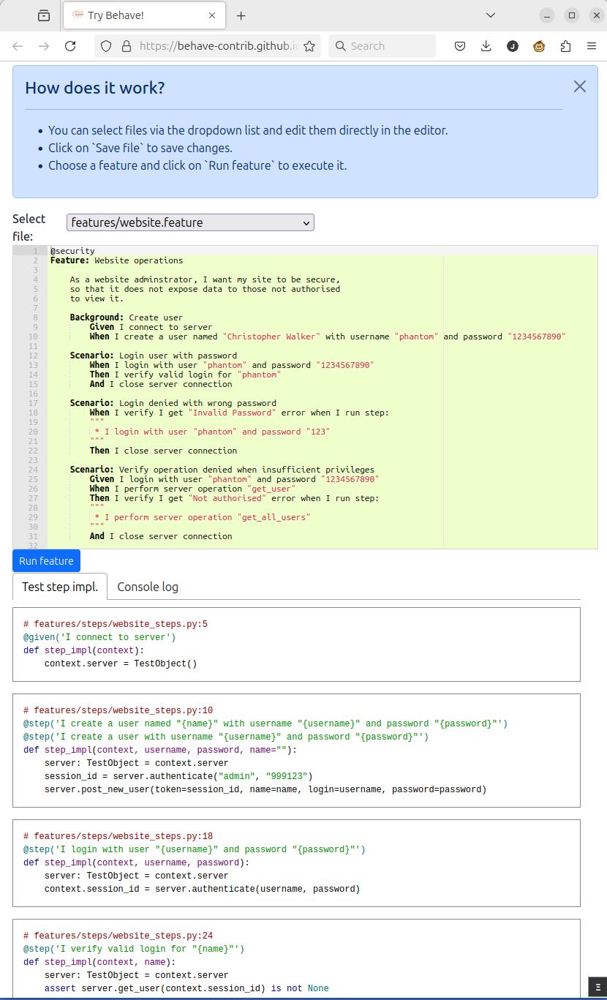

# Try Behave!

A website for trying out Python [Behave](https://behave.readthedocs.io/en/stable/) in the browser using [Pyodide](https://pyodide.org).

## Screenshot

## Try it!

Try out `Try Behave!` live [here](https://behave-contrib.github.io/try-behave/).

If you want to illustrate a specific example using `Try Behave!`, you can restrict the contents of the `Select file` dropdown via the optional `files` URL parameter. Provide a comma separated list of the files you want to remain in the list:

    https://behave-contrib.github.io/try-behave/?files=features%2Fninja.feature%2Cfeatures%2Fsteps%2Fninja.py

## Local installation

You need [Node.js](https://nodejs.org) to build `Try Behave!`. To build and run `Try Behave!` locally, clone this repo, `cd` into the repository folder and run `npm install`. To start at the application at http://localhost:3000/try-behave, run `npm start`.

## Acknowledgements

The example features, feature step implementations and model classes are Copyright (c) their respective owners. The relevant copyright notices and license information are included at the top of each source file.

This repository redistributes [r1chardj0n3s/parse](https://github.com/r1chardj0n3s/parse) in binary form. This is needed because the aforementioned project does not distribute a pure Python `py3-none-any.whl` on [pypi](https://pypi.org/) as required for use with Pyodide. The package `r1chardj0n3s/parse` is licensed under the MIT License and Copyright (c) 2012-2019 Richard Jones <richard@python.org>.

`Try Behave`is largely based on James Westfall's [behave-gui](https://github.com/behave-contrib/behave-gui) which is Copyright (c) 2021-present Tomra Systems ASA. The `behave-gui` project is licensed under the MIT License. Copyright notices have been retained at the top of all related files.
